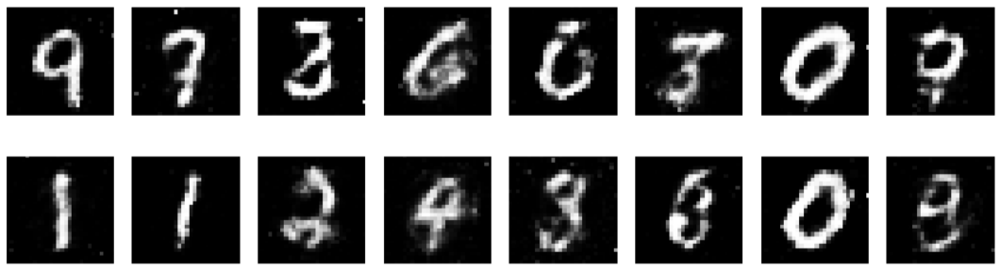
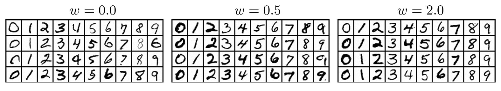
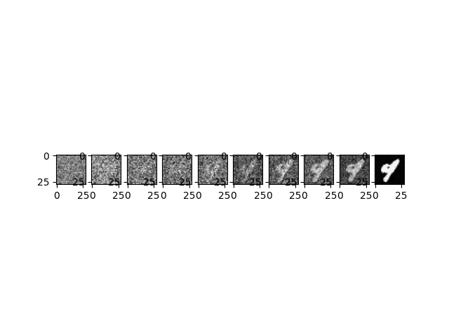

# SSL-2023
Small group project in Self supervised learning

## Group
Øyvind Monsen -- oyvimons@stud.ntnu.no  
Tor Dyrdal Strande -- tordstr@stud.ntnu.no  
Karl Erik Hofseth -- karlehof@stud.ntnu.no

## Goal

The goal for this project is to build a simple Denoising Diffusion Probabilistic Model (DDPM) to generate images with handwritten numbers based on the MNIST dataset. 


## DDPMs
Denoising Diffusion Probabilistic Models generate new samples that fit in a distribution by following a diffusion process. This is a Markov chain where each step removes some noise from the last. The prediction Markov chain is typically referred to as the reverse process. To generate sample a forward process takes a sample from the original distribution (for example an image) and gradually adds noise to it. the process is illustrated in the below image. 


(Image credits: [cvpr2022](https://cvpr2022-tutorial-diffusion-models.github.io/))

## Self-supervised
DDPMs are examples of self-supervised training methods. The training examples are automatically generated by adding some amount of random noise to examples from the dataset. Then, a model is trained to predict this noise. It is this noise-prediction model that is used to find the noise to be removed at each step in the reverse chain as mentioned above.
This is why we argue that this technique is self-supervised learning even if the term is not mentioned in the [paper](https://arxiv.org/pdf/2006.11239.pdf) introducing Denoising Probabilistic Models.

## Other methods
In the field of image generation, we have not found any supervised methods to compare our method to. We believe that this is because images can look quite different while still satisfying the distribution they are based on, meaning that it is hard to annotate a correct answer. For example, there are many ways to write any given digit, but all of them are equally correct.

The most popular technique outside of diffusion models are GANs (generative adversarial networks), which is an unsupervised method (from the standpoint of the generator). But, in most recent years’ diffusion models have been more popular. As a comparison we have included some generated samples from a GAN trained for 100 epochs (Credits [sssingh](https://github.com/sssingh/mnist-digit-generation-gan)).


An enhanced method based on the method we have used is called conditional diffusion models. These models use some condition to constrict the sample generated. An example would be to enter in a digit and then generate a handwritten image of that digit. We would argue that this is still self-supervised learning as the input is generated by adding noise to the image. And even if the input is expanded the input/label pair still needs to be generated. For completeness we have added some generated samples from a conditioned diffusion model, trained for 20 epochs. (Credits [TeaPearce](https://github.com/TeaPearce/Conditional_Diffusion_MNIST)) (The W is guidance factor, a hyperparameter deciding how diverse the images should be).


## Model

The model we train is a simple U-Net model. It takes as input a noisy image and a timestep along the diffusion process. Based on this it outputs a prediction on which noise has been added to the image. 


## Dataset / Example generation
The dataset we are using for this task is MNSIT handwritten digits. This dataset is labelled, but to keep with the spirit of the SSL-task we just use the images. These images are normalized to [-1, 1].
To create an example for the network to train on we do the following.
We take an unaltered image and noise with the same dimension as the image sampled from a normal distribution and create an interpolation between the two images. A parameter time_step decides how much weight is assigned to the original image and how much is assigned to the noise.
The resulting noisy image and the time_step will be the input to the network and the sampled noise is the target.

## Training

The following hardware was used for training:

- CPU: AMD Ryzen 7 3700X
- GPU: Nvidia RTX 2080ti, 11GB VRAM
- RAM: 32GB

The model was trained for 100 epochs with a batch size of 512, an Adam optimizer with learning rate of `0.001`.

Loss plateaued as soon as around 20 epochs.

The total training took around 5.5 minutes for 20 epochs and around 30 minutes for 100 epochs.


## Sampling
To sample an image, we start from normal distribution noise with the same dimensions as our training data.
We then remove noise in each iteration until we end up with what hopefully should look like an image belonging to our dataset.

In more detail:
In each iteration the network predicts the noise in the image and a fraction of this predicted noise is removed.
Then a small amount of noise from a new normal distribution is added back to the image.
In the last iteration no noise is added to the image.
Both the noise added to the image and how much noise is removed is decided by hyperparameters called the noise schedule.


## Results

Example result from the model, also showing the steps going from random noise to the sample: 




## How to run 

First, dependencies must be installed: 
```bash
pip install -r requirements.txt
```

To train a model run 
```bash 
python model.py train
```

Then, to generate examples use

```bash
python model.py predict -l model
```
